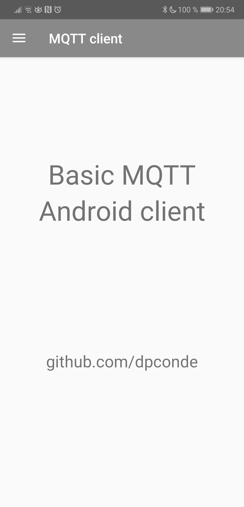
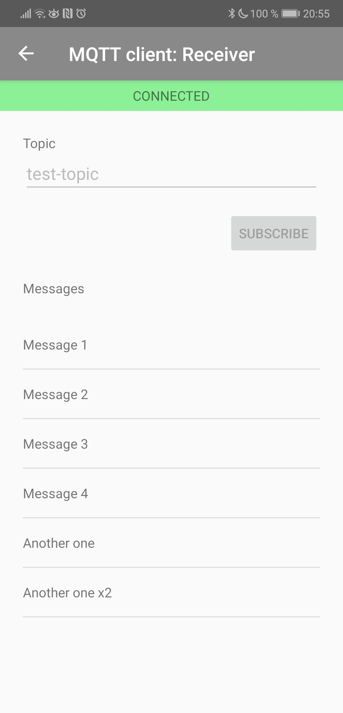
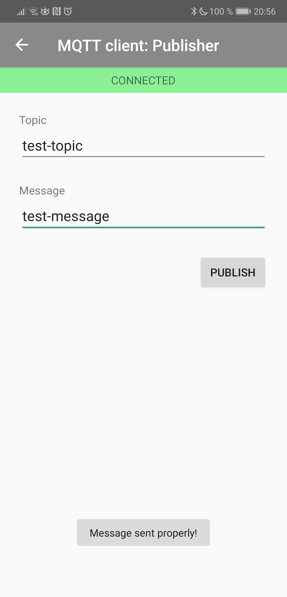
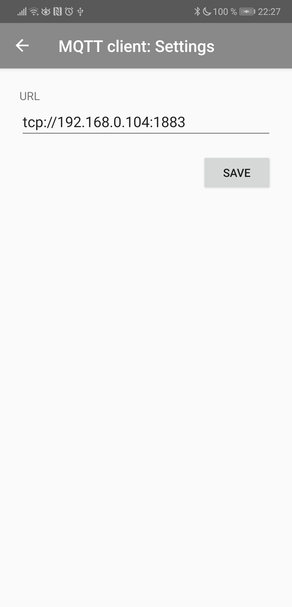

# MQTT Android client
A basic MQTT Android client

## Used technology
* Kotlin
* MVVM
* Data binding
* Dagger2
* LiveData
* AndroidX Navigation

## Screenshots
    
    


## Deploy local MQTT server
A Dockerfile in docker directory is available in order to deploy a local RabbitMQ MQTT server:

```
docker build --tag rabbitmq-mqtt:1.0 .
```
```
docker run -d --hostname rabbitmqhost --name rabbitmq -p 15672:15672 -p 5672:5672 -p 1883:1883 rabbitmq-mqtt:1.0
```
